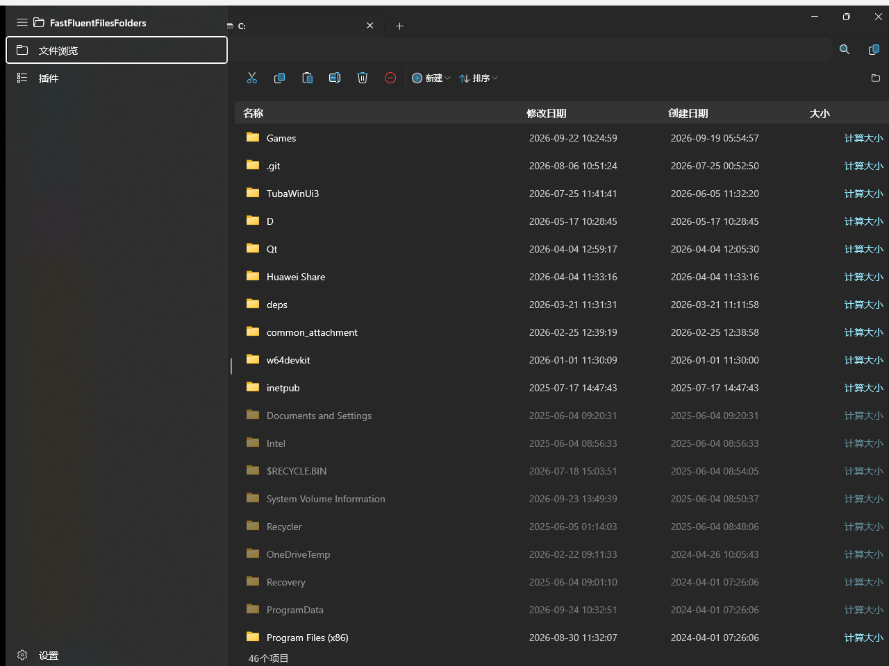
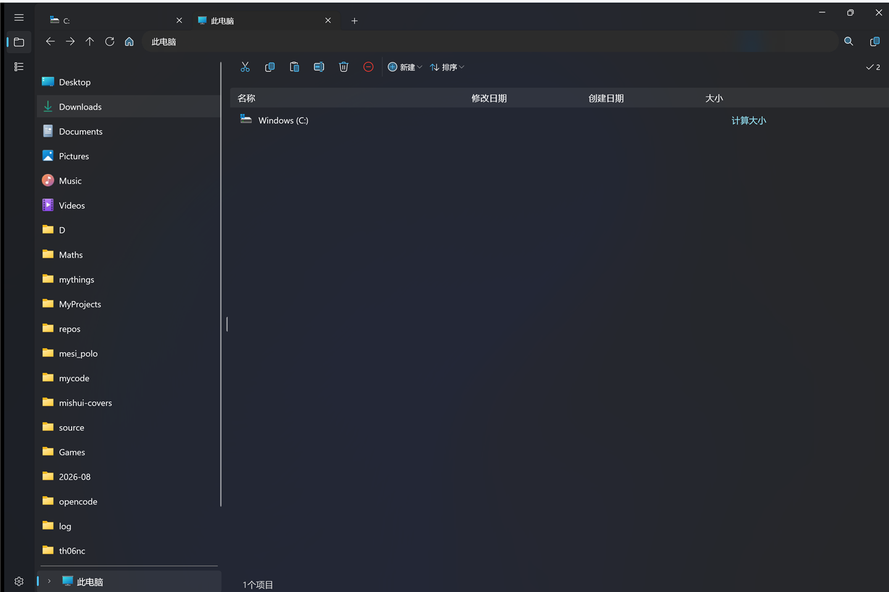
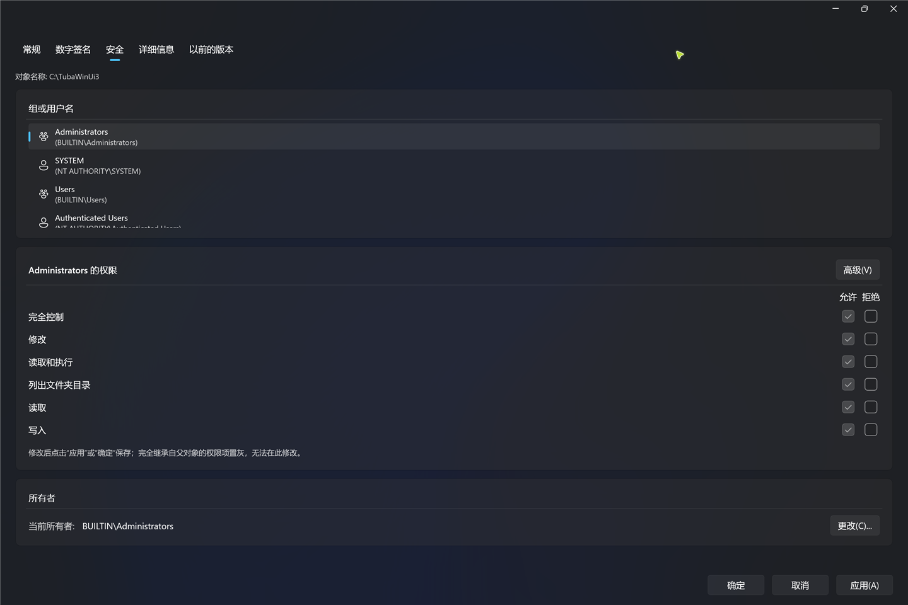
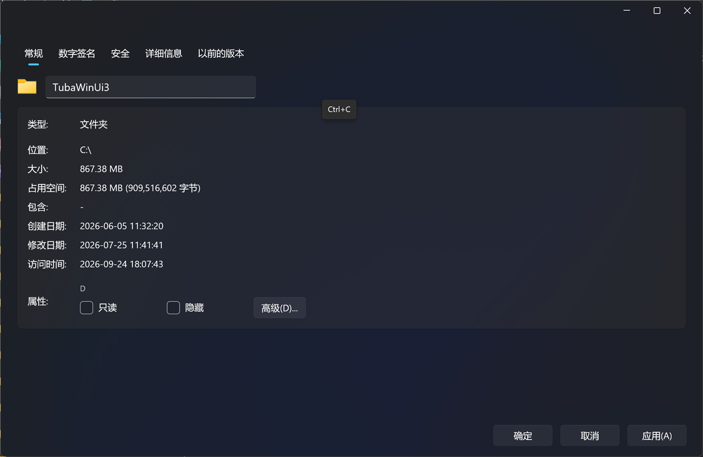
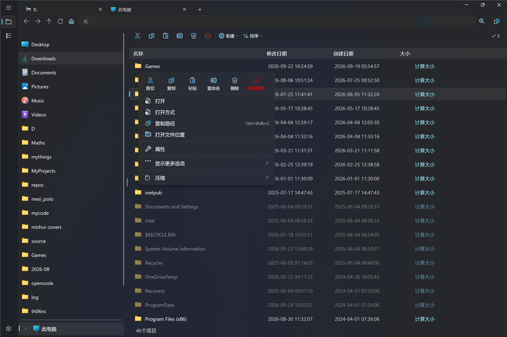

# FastFluentFilesFolders 1.1.0 简介

1.1.0 是一次大版本更新：新增多标签页、Windows 系统位置与回收站支持，重做了属性弹窗、右键菜单与整套图标系统，并大幅提升了文件操作的可靠性与整体流畅度。

*主界面：多标签页 + 面包屑地址栏 + 目录树 + 文件表格（名称 / 修改日期 / 创建日期 / 大小）+ 状态栏。*

## 主要更新

### 多标签页

- 顶部标签栏浏览多个位置，`Ctrl+T` 新建、`Ctrl+W` 关闭，标签可拖拽排序。
- 每个标签独立维护浏览历史与搜索状态；切换标签时目录树自动高亮对应文件夹。

### 侧栏与系统位置

- 侧栏对齐资源管理器：**此电脑、网络、Linux（WSL）、回收站、云盘**，驱动器统一收纳进「此电脑」，显示为「卷标 (X:)」。
- WSL 发行版与云盘（OneDrive / Dropbox / 坚果云等）自动检测，图标取自真实系统命名空间。

*「此电脑」与侧栏系统位置。*

### 回收站

- 可在应用内直接浏览回收站（新增「原位置」列）、还原、彻底删除、清空。
- 进入回收站自动切换专属工具栏，无选中项 / 空回收站时按钮自动置灰。

### 文件操作更可靠

- 剪切、粘贴、删除全部按**磁盘真实结果**逐项推进：成功才移除条目，失败保留并显示原因。
- 剪切遇到同名项时弹一次确认框（替换 / 跳过 / 保留两者）；跨盘移动改为「复制成功后删源」，同名目录替换执行递归合并。
- 修复幽灵条目、粘贴到子文件夹落错位置、地址栏相对路径失效等一系列问题。

### 属性弹窗重做

- 全新 WinUI 子窗口，选项卡涵盖**常规、数字签名、安全、详细信息、以前的版本**，`.exe` 另有**兼容性**页。
- 安全页可直接编辑权限（允许 / 拒绝矩阵），并新增**更改所有者**；权限不足时自动请求 UAC 提权重试，无需手动以管理员身份重启应用。
- 文件夹的大小与占用空间分别按逻辑大小、磁盘分配计算；数字签名页可解析真实摘要算法与签名时间戳。

*属性弹窗（安全页）：权限矩阵、高级安全设置与「所有者 / 更改」卡片。*

*属性弹窗（常规页）。*

### 图标与外观

- 右键菜单、工具栏、地址栏的字形图标全部换成 **ThemedIcon 矢量图标**（由 Segoe Fluent Icons 字形轮廓矢量化），跟随主题与强调色，不再依赖字体渲染。
- 右键菜单重做：二级列表使用自定义模板（可显示两色图标）、横向撑满菜单，并带悬停 / 按下过渡动画。
- 隐藏文件与系统文件改为半透明显示；文件表格新增 / 删除条目带淡入与上移补位动画。

*右键菜单：一级命令栏 + 二级列表，全部为矢量图标。*

### 性能与流畅度

- 表格整表一次性替换、导航走快速路径与祖先链查找、图标请求批量合并 + 赋值防抖，进入大文件夹不再逐条刷新。
- 驱动器枚举移到后台线程（单盘 2 秒超时），启动速度与内存占用进一步优化。

### 插件与扩展

- 压缩 / 解压插件支持 `zip`、`7z` 等格式，并可在地址栏中直接**浏览压缩包内部**。
- 插件可注入右键菜单项、地址栏工具按钮与设置卡片，导入 / 卸载在「插件」页完成。

### 其他

- 新增设置项：系统背景材质、切换动画、图标并行加载数量、按时间分组文件夹等。
- 中英文完整覆盖，切换语言即时生效。

## 安装

- 环境：Windows 10 19041+ / Windows 11。
- 安装包为自签名，若系统不信任，可先导入[证书](https://www.mishui.city/upload/CertForLRS.cer)：
  `Import-Certificate -FilePath "<证书路径>" -CertStoreLocation "Cert:\CurrentUser\TrustedPeople"`

---

*本简介基于 1.1.0 实际运行版本截图整理，图片位于 `docs/images/1.1.0/`。*
